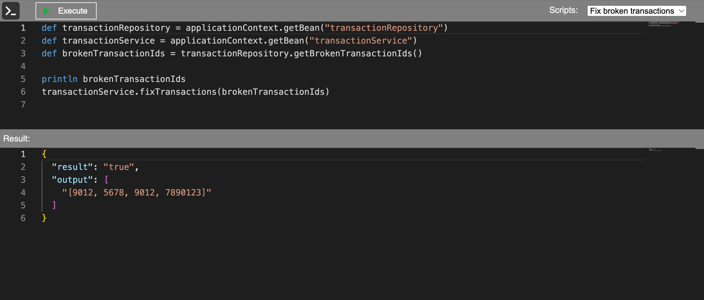

# Spring Groovy Web Console


[](https://jitpack.io/#BOOMeranGG/spring-groovy-web-console)

## Overview
This library embeds a Groovy console into your Spring Boot application, providing access to the Spring context.
It enables you to run Groovy scripts directly from your web browser, making it an excellent tool for testing and debugging



## Features
- **GroovyScriptExecutionInterceptor** – hook into script execution lifecycle
- **GroovyScriptStorage** - plug in your own script storage mechanism (e.g., DB, in-memory)
- **CompilerConfiguration** - customize the Groovy compiler settings
- **Spring Boot Security** (optional) - integrates seamlessly if security is enabled


## Dependency
This library is hosted on Jitpack. To use it, you need to add the following dependency:

<details>
<summary>Gradle Kotlin</summary>

```kotlin
implementation("com.github.BOOMeranGG:spring-groovy-web-console:0.1")
```
</details>

<details>
<summary>Gradle Groovy</summary>

```groovy
implementation 'com.github.BOOMeranGG:spring-groovy-web-console:0.1'
```
</details>

<details>
<summary>Maven</summary>

```xml
<dependency>
  <groupId>com.github.BOOMeranGG</groupId>
  <artifactId>spring-groovy-web-console</artifactId>
  <version>0.1</version>
</dependency>
```
</details>

Also, you need to add Jitpack repository to your build file:
<details>
<summary>Gradle</summary>

```groovy
repositories {
    maven {
        url = uri("https://jitpack.io")
    }
}
```
</details>

<details>
<summary>Maven</summary>

```xml
<repositories>
    <repository>
        <id>jitpack.io</id>
        <url>https://jitpack.io</url>
    </repository>
</repositories>
```
</details>


## Usage
After adding the dependency, you can open your browser and navigate to `http://localhost:{port}/console`

The following configurations are optional, but can be useful depending on your needs:

- To configure the library, you can change the following properties in your `application.properties` or `application.yml`:

```yaml
groovy-web-console:
  enabled: true
  examples:
    enabled: true
  api:
    web-console-page:
      prefix: /console
```

- You can implement **GroovyScriptExecutionInterceptor** (multiple interceptors can be registered):
```kotlin
interface GroovyScriptExecutionInterceptor {

    fun onPreExecute(scriptId: String, script: String)

    fun onPostExecute(scriptId: String, script: String)

    fun onFailed(scriptId: String, script: String, ex: Exception)
}
```
- And also implement **GroovyScriptStorage** to store and retrieve scripts (multiple storages can be registered):
```kotlin
fun interface GroovyScriptStorage {

    fun getScripts(): List<GroovyScriptData>
}
```

- You can configure `org.codehaus.groovy.control.CompilerConfiguration`, for example:
```kotlin
    @Bean
    fun compilerConfiguration(): CompilerConfiguration {
        val configuration = CompilerConfiguration()
        val secureCustomizer = SecureASTCustomizer()
        secureCustomizer.disallowedReceivers = listOf("java.lang.System")

        configuration.addCompilationCustomizers(secureCustomizer)
        return configuration
    }
```
To do that, you have to install `implementation 'org.apache.groovy:groovy-all:{version}'` dependency.


## Contributing
Contributions are welcome and appreciated - feel free to open issues or create a PR


## Acknowledgement
The frontend of this library uses [Monaco Editor](https://github.com/microsoft/monaco-editor) — big thanks to the awesome team behind it!
